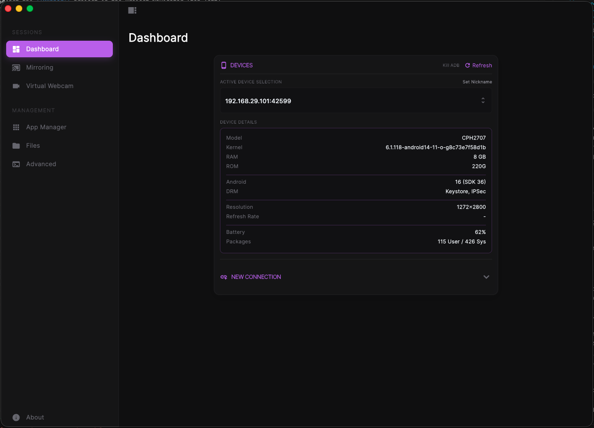

# Android Candy

**A modern, premium desktop client for Scrcpy.**
*Control your Android device with style, speed, and simplicity.*



## ✨ Features

### 🖥️ Screen Mirroring
High-performance, low-latency screen mirroring with full keyboard and mouse control. Supports high refresh rates (up to 120Hz+).

### 📸 Camera Mirroring
Use your phone's camera as a high-quality monitor feed or webcam source. Granular control over resolution, FPS, and rotation.

### 📂 File Manager (Enhanced)
Drag-and-drop file management with a beautiful UI.
- **Visuals:** Grid and List views with rich file icons.
- **Sorting:** Sort by Name, Size, Type, or Date.
- **Navigation:** Editable path bar with autocomplete for quick access.

### 📱 App Manager & Launcher
- **Launch:** Start apps directly from the desktop client.
- **Manage:** Install APKs, uninstall apps, and search your package list.

### ⚡ Fastboot Controls
Advanced tools for power users.
- **Reboot Modes:** Easily reboot to System, Bootloader, or Recovery.
- **Safe Execution:** Commands are executed safely with visual feedback.

### 🛠️ Advanced Options
Fine-tune your experience with bitrate controls, codec selection (H.264, H.265, AV1), and screen recording settings.

---

## 🚀 Installation (macOS)

### Prerequisites
You must have `scrcpy` and `adb` installed on your system.
```bash
brew install scrcpy android-platform-tools
```

### Download
1.  Download the latest `AndroidCandy.dmg` from the [Releases](https://github.com/imAdityaSharma/scrcpy-gui-flutter/releases) page.
2.  Open the DMG and drag **Android Candy** to your **Applications** folder.

### ⚠️ First Launch (Important)

 macOS will likely block the app because it isn't notarized. You might see **"App is damaged"** or **"Unidentified Developer"**.

**To bypass this:**
1.  Open your **Applications** folder.
2.  **Right-Click (Control+Click)** on **Android Candy**.
3.  Select **Open** from the menu.
4.  Click **Open** in the confirmation dialog.

*If you still get a "Damaged" error, run this command in Terminal:*
```bash
sudo xattr -cr /Applications/"Android Candy.app"
```

---

## 🛠️ Building from Source

If you prefer to build it yourself:

1.  **Clone the repository:**
    ```bash
    git clone https://github.com/108slashpheonix/scrcpy-gui-flutter.git
    cd scrcpy-gui-flutter/scrcpy-gui-flutter
    ```

2.  **Install dependencies:**
    ```bash
    flutter pub get
    cd macos && pod install && cd ..
    ```

3.  **Build Release:**
    ```bash
    flutter build macos --release
    ```

---

## 🤝 Credits

- Core Engine: [scrcpy](https://github.com/Genymobile/scrcpy) (Genymobile)
- UI Framework: [Flutter](https://flutter.dev)
- Original Inspiration: [kil0bit-kb](https://github.com/kil0bit-kb/scrcpy-gui)
