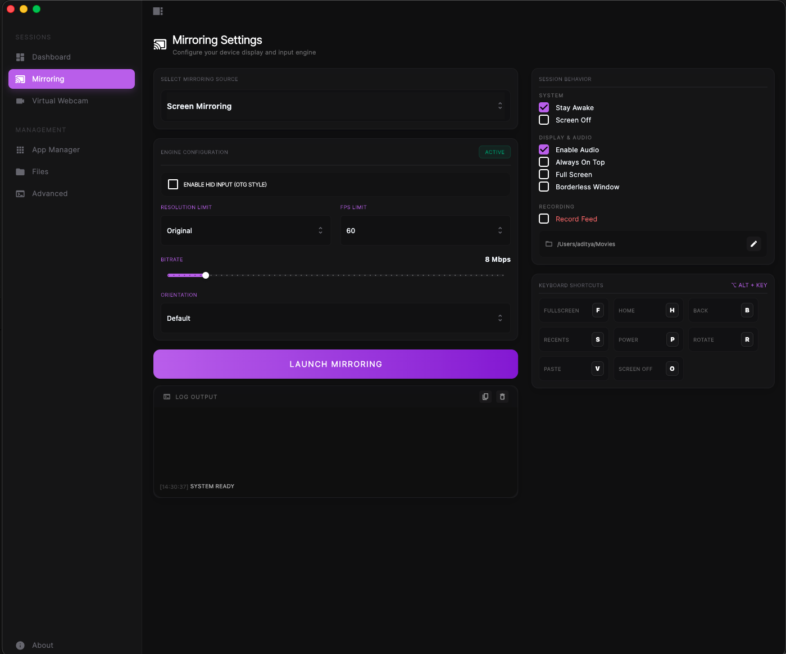
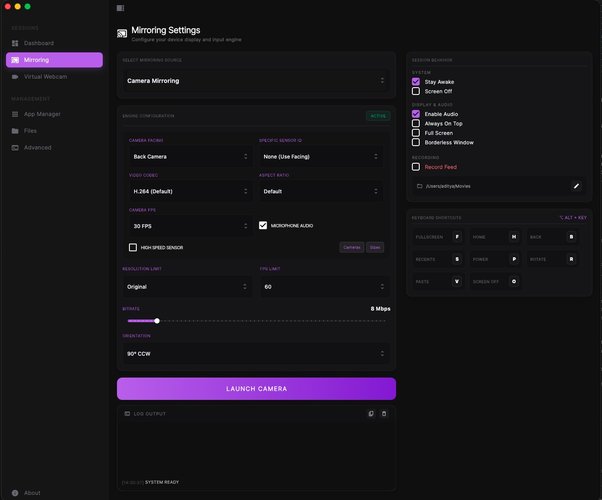
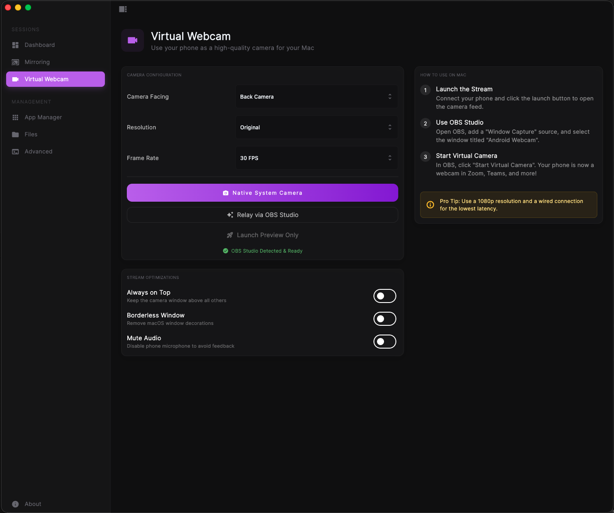
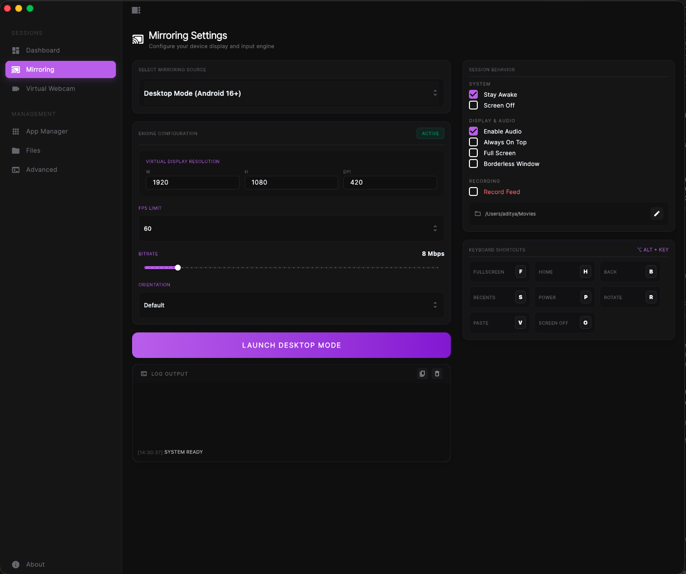
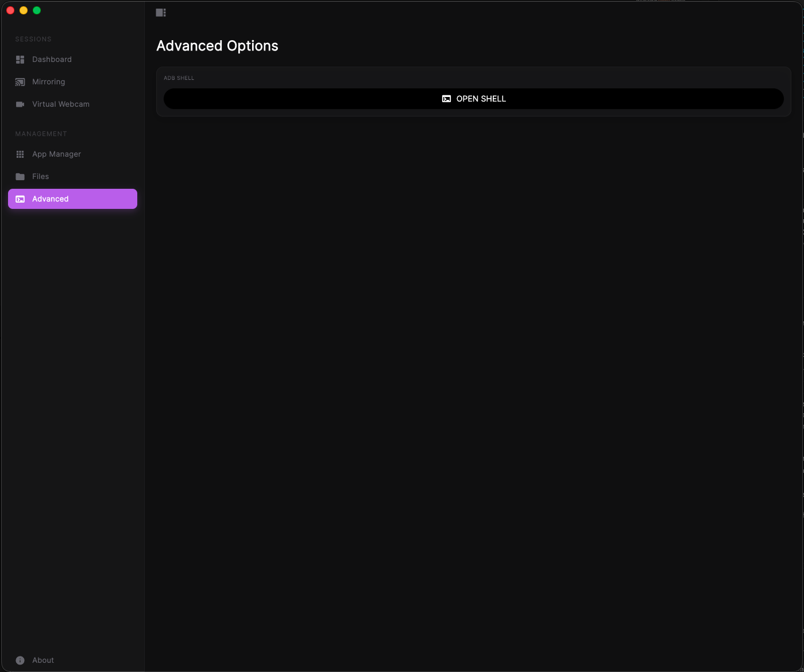

# Scrcpy GUI (Flutter)

A modern, cross-platform graphical user interface for [scrcpy](https://github.com/Genymobile/scrcpy), enabling seamless Android control.

### Dashboard

Centralized hub for managing devices, connections, and system status in real-time.

### Screen Mirroring

High-performance, low-latency screen mirroring with keyboard and mouse control.

### Camera Mirroring

Professional-grade camera mirroring with granular control over FPS, rotation, and resolution.

### Virtual Webcam (macOS Native) - *Coming Soon*

Turn your phone into a system-wide native webcam without needing third-party drivers (currently in development).

### File Explorer

Drag-and-drop file management for effortless transfer between your computer and Android device.

### App Management

Install, uninstall, and manage Android applications with a single click.

### Desktop Mode

Experience a full desktop-like environment for supported Samsung DeX and similar devices.

### Advanced Options

Fine-tune bitrate, codecs (H.264/H.265/AV1), and recording settings for power users.

## Getting Started

1.  **Prerequisites**: Ensure `adb` and `scrcpy` are installed and in your system PATH (`brew install scrcpy android-platform-tools` on macOS).
2.  **Installation**: Clone the repo, run `flutter pub get`, and launch with `flutter run -d macos`.
